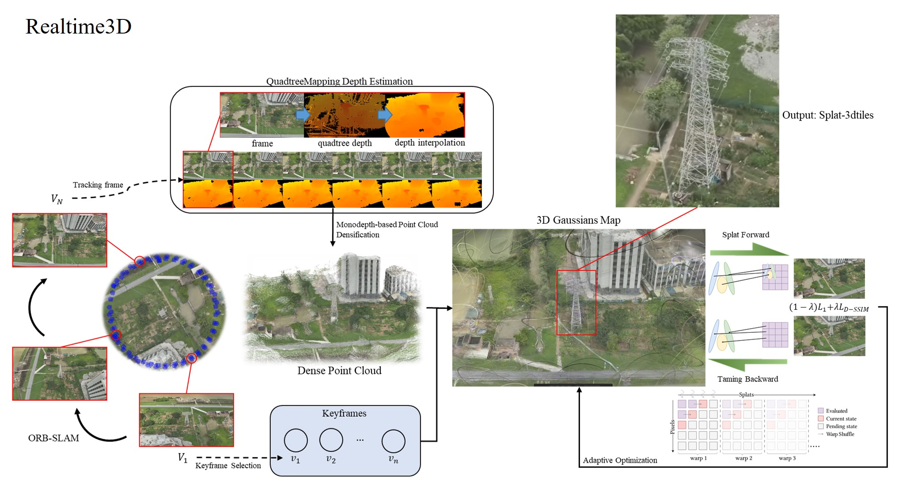
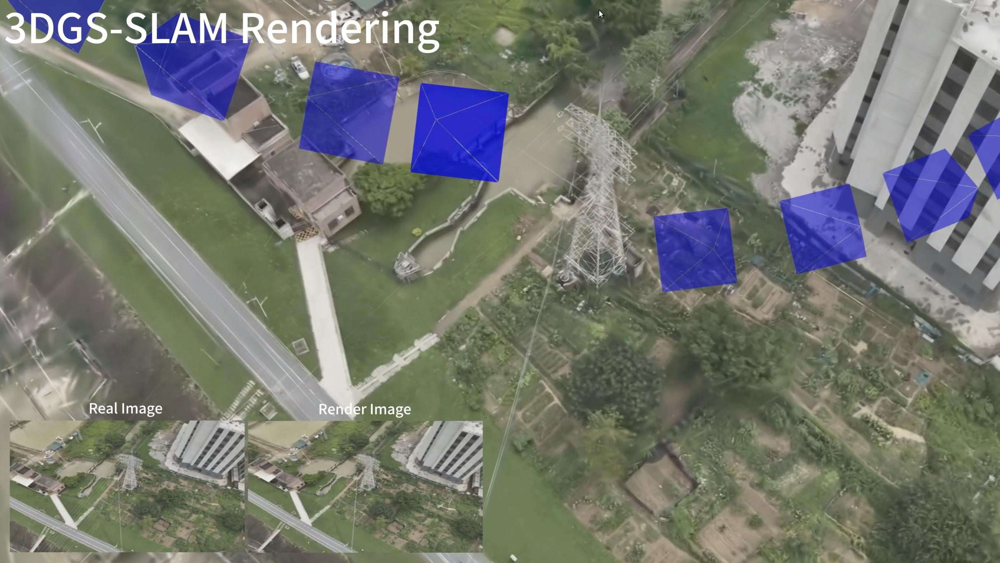

# Realtime3d

关键技术：3DGS-SLAM, ORB-SLAM, QuadtreeMapping, Taming Backward

youtube：https://youtube.com/watch?v=SvMQc_1qst8

Credits:

[ORB_SLAM2](https://github.com/raulmur/ORB_SLAM2)

[ORB_SLAM3](https://github.com/UZ-SLAMLab/ORB_SLAM3)

[open_quadtree_mapping](https://github.com/HKUST-Aerial-Robotics/open_quadtree_mapping)

[taming-3dgs](https://github.com/humansensinglab/taming-3dgs)

